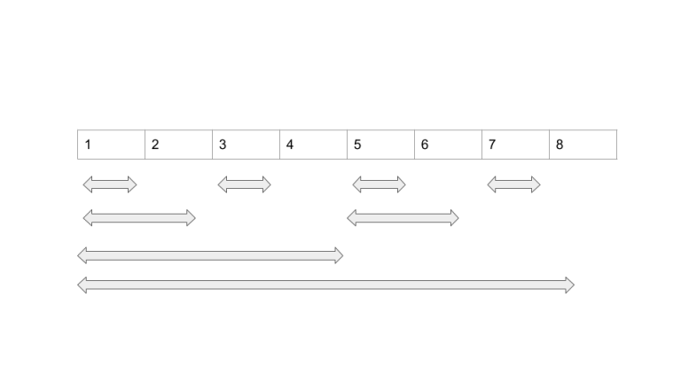

# Fenwick tree - дерево Фенвика.
[Назад к алгоритмам](../algorithms.md)
### Описание
Позволяет для массива считать функции на префиксе и обновлять элементы. 
Для этого будем считать элементы с 1.
Тогда каждый элемент на позиции i в массиве будет отвечат за отрезок, заканчивающийся в этом элементе и размером 2^k делящий i максимальный.
Пример:

Тогда что бы найти длину отрезка нужно всего лишь `i & -i`.
И потом отнимать длину отрезка от i.

Тут 2 функции:
1) upd - обновляет все отрезки которые покрывают элемент.
2) query - получает значение функции префикса

Также легко обощить на многомерный случай.

[Реализация](fenwick_tree.h)
### Источники
- [codeforces](https://codeforces.com/blog/entry/57292?locale=ru)
- [emaxx](http://e-maxx.ru/algo/fenwick_tree)
